# hgb

[](https://github.com/6br/hgb/actions/workflows/rust.yml)

A hybrid genome browser for zooming out long-read alignments

Screenshots in seconds.

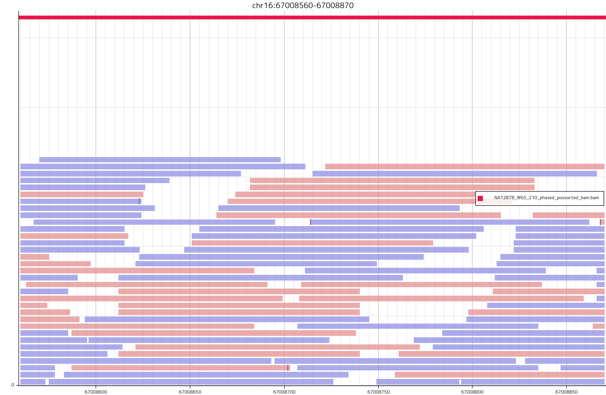

Integrated with [Udon](https://github.com/ocxtal/udon):

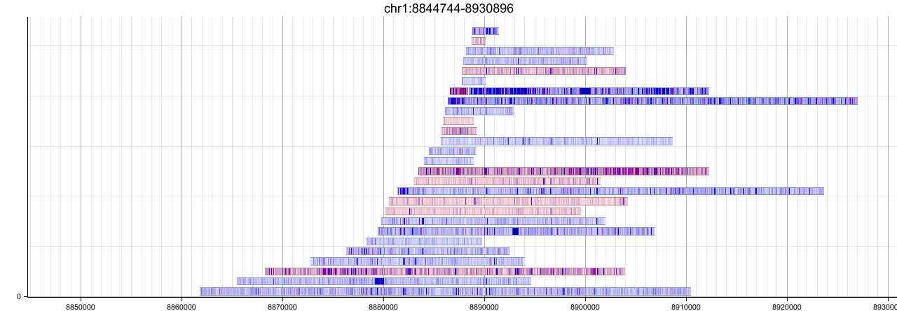

## Features

* A light-weight binary to visualize read alignments as PNG/JPG/BMP files.
* Visualize read alignments more than 100 samples at once.
* Much more options to visualize read alignments.

## Install

If you didn't install Rust/cargo, you need to install rustup.

```bash
curl --proto '=https' --tlsv1.2 -sSf https://sh.rustup.rs | sh
```

```bash
git clone https://github.com/6br/hgb
cd hgb
cargo build --release
cargo run --release -- vis --help
```

## Usage

The input BAM file **must** be indexed using `samtools index`. The input BAM file *needed to* be calculated MD tag using `samtools calmd` if mismatches are to be visualized.

```bash
samtools calmd -b aln.bam ref.fasta > input1.bam
samtools index input1.bam
```

### Examples

* A simple example:

```bash
cargo run --release -- vis -a test/input1.bam -o fig/output1.png -r chr1:93234-94334
```

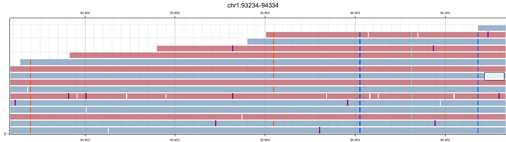

* A simple example with [Udon](https://github.com/ocxtal/udon) mode:

```bash
cargo run --release -- vis -a test/input1.bam -o fig/output2.png -l -U -r chr1:93234-94334
```

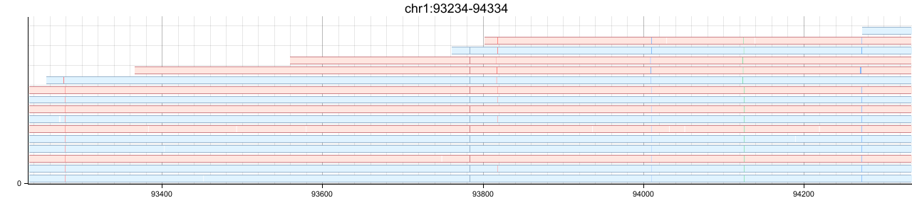

* A simple example with two bam files:

```bash
cargo run --release -- vis -a test/input1.bam test/input2.bam -o fig/output3.png -r chr1:93234-94334
```


* A simple example with two bam files of split alignments:

```bash
cargo run --release -- vis -a test/input1.bam test/input2.bam -o fig/output4.png -r chr1:93234-94334 -s
```


* A simple example with two bam files with base colors:

```bash
cargo run --release -- vis -a test/input1.bam test/input2.bam -o fig/output5.png -r chr1:93234-93334 -B
```

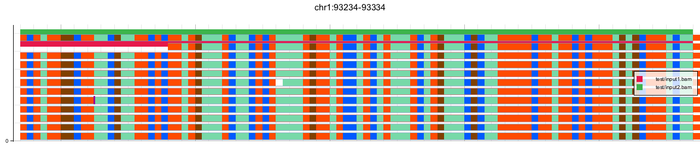

* A simple example with two bam files with read quality:

```bash
cargo run --release -- vis -a test/input1.bam test/input2.bam -o fig/output6.png -r chr1:93234-94334 -q
```

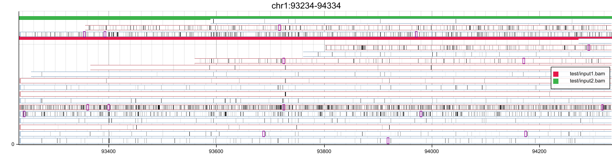

* A simple example with two bam files with hidden legends:

```bash
cargo run --release -- vis -a test/input1.bam test/input2.bam -o fig/output7.png -r chr1:93234-94334 -l
```

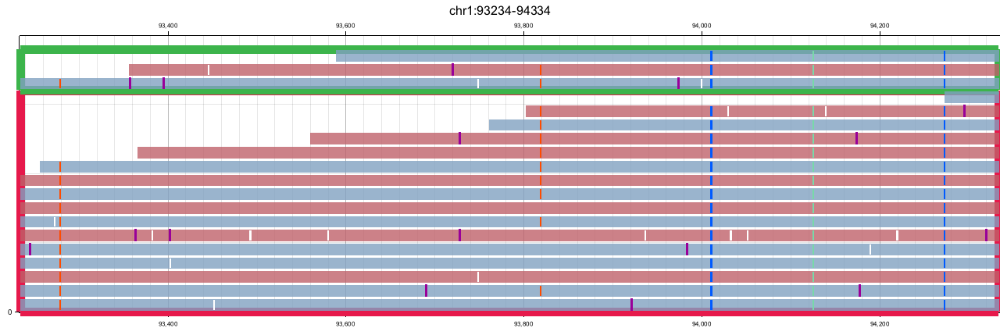

* A simple example with two bam files within 10x coverages at most:

```bash
cargo run --release -- vis -a test/input1.bam test/input2.bam -o fig/output8.png -r chr1:93234-94334 -m 10
```

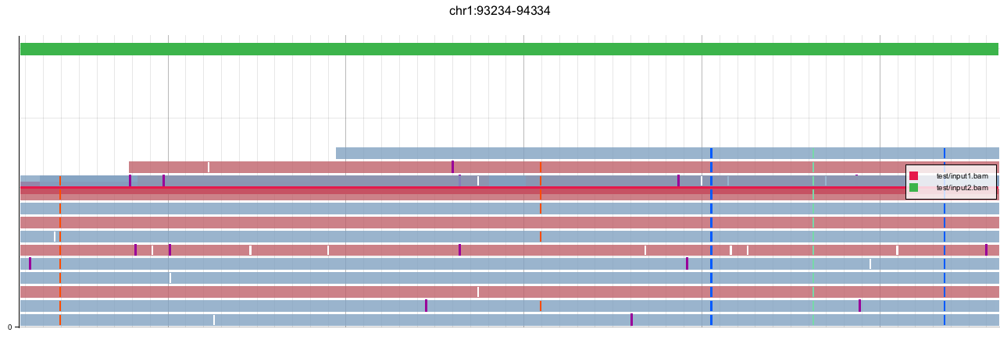

* A simple example with two bam files without insertion cigars:

```bash
cargo run --release -- vis -a test/input1.bam test/input2.bam -o fig/output9.png -r chr1:93234-94334 -I
```

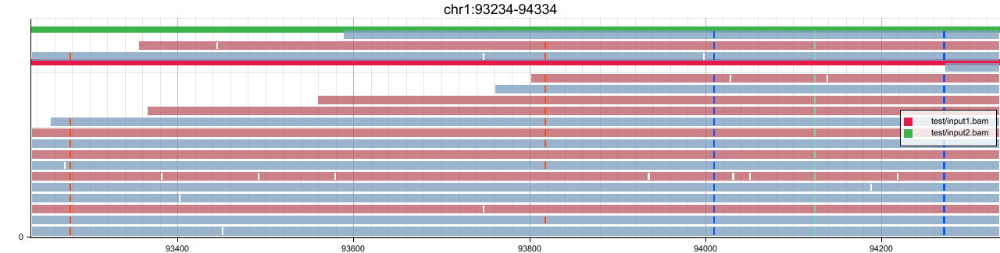

### Advanced Examples

* A simple example with two distant ranges:

```bash
cargo run --release -- vis -a test/input1.bam test/input2.bam -o fig/output10.png -r chr1:91234-92334 chr1:93234-94334 
```

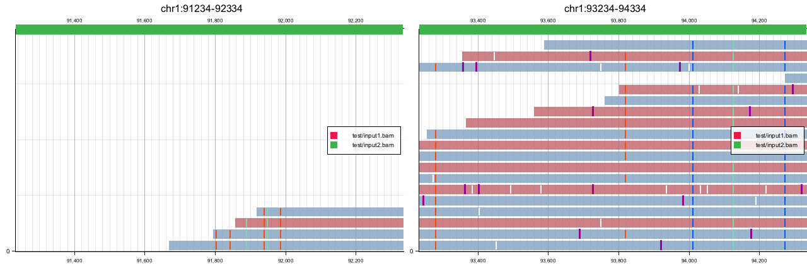

* A simple example with a custom caption:

```bash
cargo run --release -- vis -a test/input1.bam -o fig/output11.png -r chr1:93234-94334 '-<' "Caption"
```

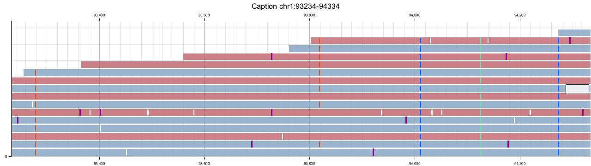

* A simple example with bases of a reference genome:

```bash
cargo run --release -- vis -a test/input1.bam -! test/hg38.2bit -o fig/output12.png -r chr1:93234-93334
```

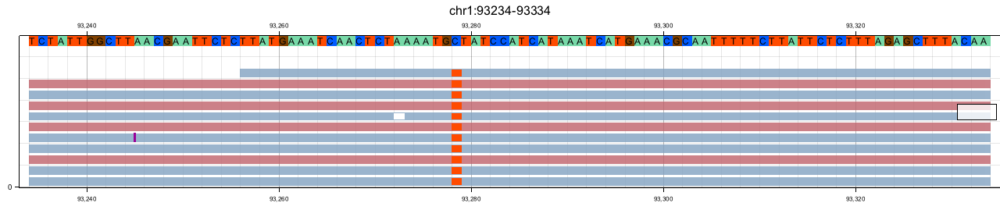

* A simple example with different preset color:

```bash
cargo run --release -- vis -a test/input1.bam -o fig/output13.png -r chr1:93234-94334 -# hgb
```

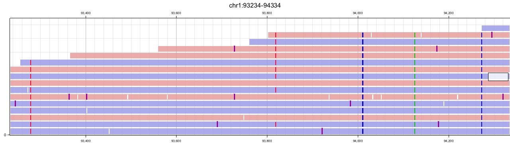

* A simple example with colored by CpG motif:

```bash
cargo run --release -- vis -a test/input1.bam -o fig/output14.png -r chr1:93234-94334 -E
```

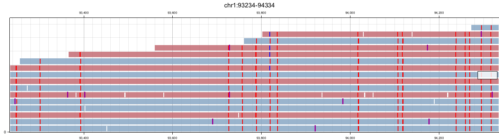

* A simple example with different labels on tracks:

```bash
cargo run --release -- vis -a test/input1.bam test/input2.bam -o fig/output15.png -r chr1:93234-94334 '-}' "SampleA" "SampleB"
```

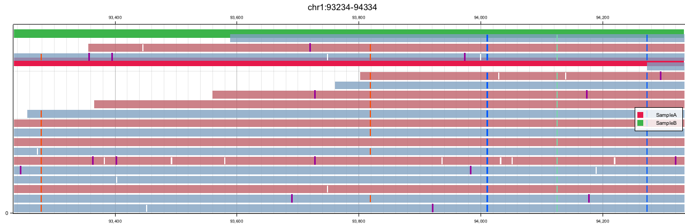

* A simple example with alignment coverage tracks:

```bash
cargo run --release -- vis -a test/input1.bam test/input2.bam -o fig/output16.png -r chr1:93234-94334 -P
```

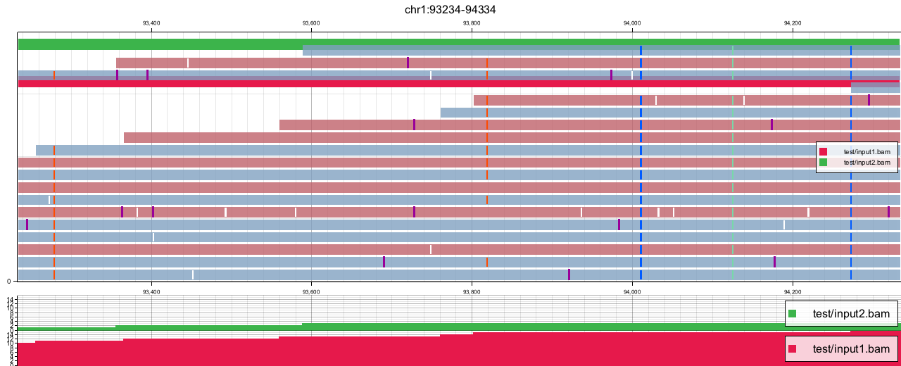

* A simple example with different read colors:

```bash
cargo run --release -- vis -a test/input1.bam -o fig/output17.png -r chr1:93234-94334 -n

```

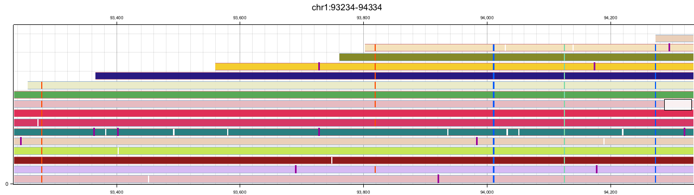

* A simple example without rulers:

```bash
cargo run --release -- vis -a test/input1.bam -o fig/output18.png -r chr1:93234-94334 -S
```

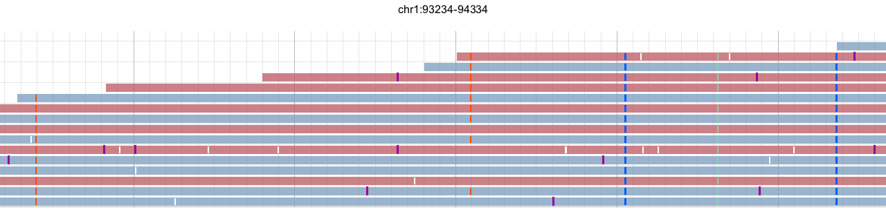

* A simple example with read ids:

```bash
cargo run --release -- vis -a test/input1.bam -o fig/output19.png -r chr1:93234-94334 -H
```

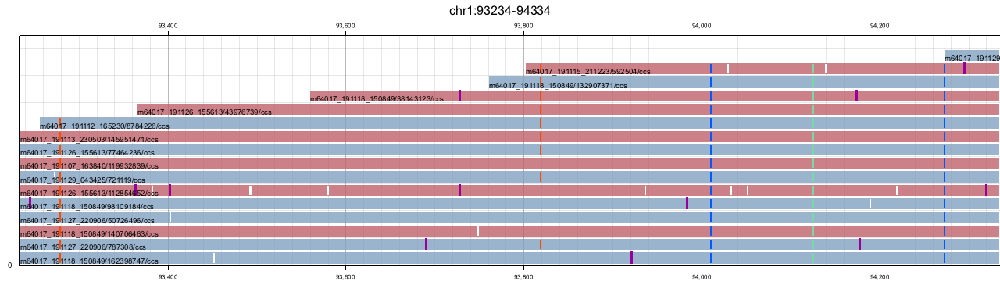

## Gallery

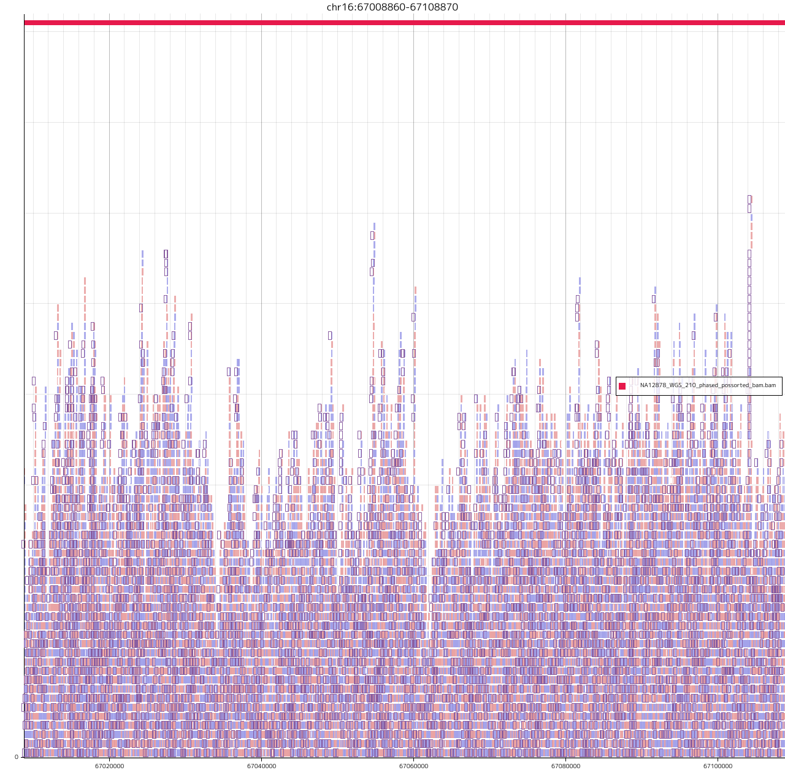

## Author

6br
