# Supplemental Information


### Read alignment visualization with default parameter 

`cargo run --release -- vis -a test/input1.bam test/input2.bam -o fig/output3.png -r chr1:93234-94334`


\newpage

### Read alignment visualization with displaying split alignments 

`cargo run --release -- vis -a test/input1.bam test/input2.bam -o fig/output4.png -r chr1:93234-94334 -s`


\newpage

### Read alignment visualization with displaying each base

`cargo run --release -- vis -a test/input1.bam test/input2.bam -o fig/output5.png -r chr1:93234-93334 -B`

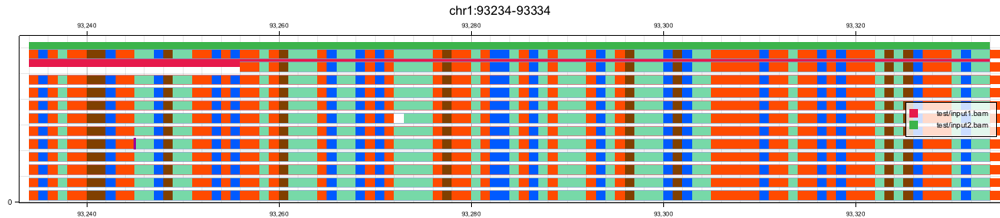

\newpage

### Read alignment visualization with read quality

`cargo run --release -- vis -a test/input1.bam test/input2.bam -o fig/output6.png -r chr1:93234-94334 -q`

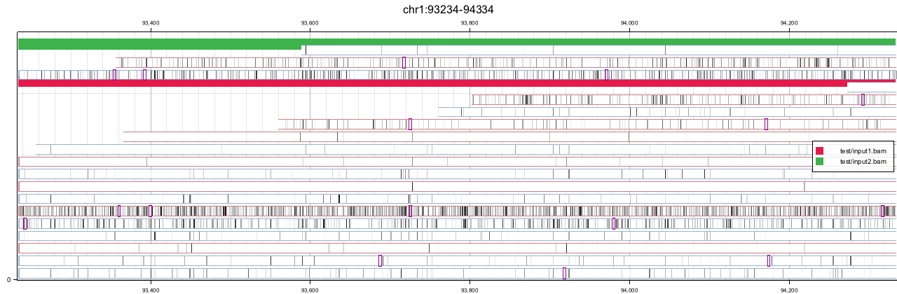

\newpage

### Read alignment visualization without legends

`cargo run --release -- vis -a test/input1.bam test/input2.bam -o fig/output7.png -r chr1:93234-94334 -l`

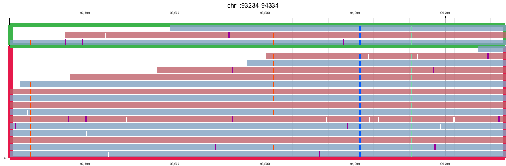

\newpage

### Read alignment visualization with coverage limit

`cargo run --release -- vis -a test/input1.bam test/input2.bam -o fig/output8.png -r chr1:93234-94334 -m 10`

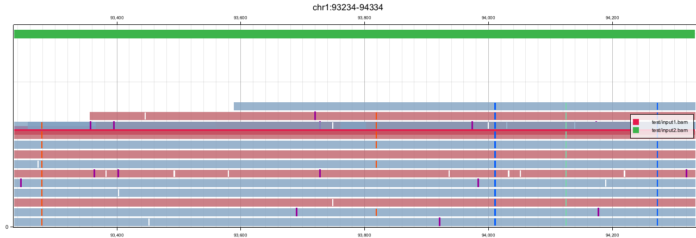

\newpage

### Read alignment visualization without insertion symbols

`cargo run --release -- vis -a test/input1.bam test/input2.bam -o fig/output9.png -r chr1:93234-94334 -I`


\newpage

### Read alignment visualization of two distant ranges

`cargo run --release -- vis -a test/input1.bam test/input2.bam -o fig/output10.png -r chr1:91234-92334 chr1:93234-94334 `

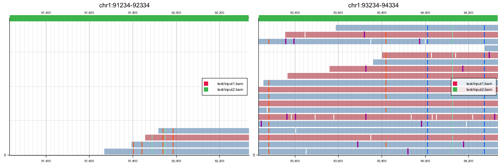

\newpage

### Read alignment visualization with a custom caption

`cargo run --release -- vis -a test/input1.bam -o fig/output11.png -r chr1:93234-94334 -< \"Caption\"`

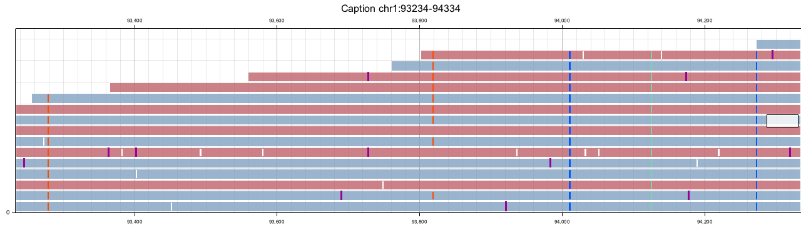

\newpage

### Read alignment visualization with a reference genome sequence

`cargo run --release -- vis -a test/input1.bam -! test/hg38.2bit -o fig/output12.png -r chr1:93234-93334`

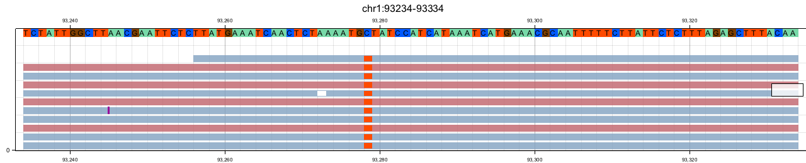

\newpage

### Read alignment visualization colored by CpG motif  

`cargo run --release -- vis -a test/input1.bam -o fig/output14.png -r chr1:93234-94334 -E`

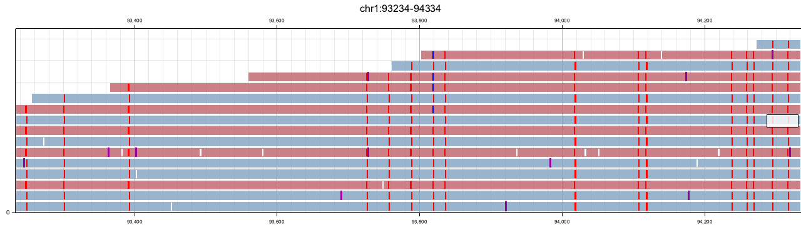

\newpage

### Read alignment visualization with different labels on tracks

`cargo run --release -- vis -a test/input1.bam test/input2.bam -o fig/output15.png -r chr1:93234-94334 -} \"SampleA\" \"SampleB\"`

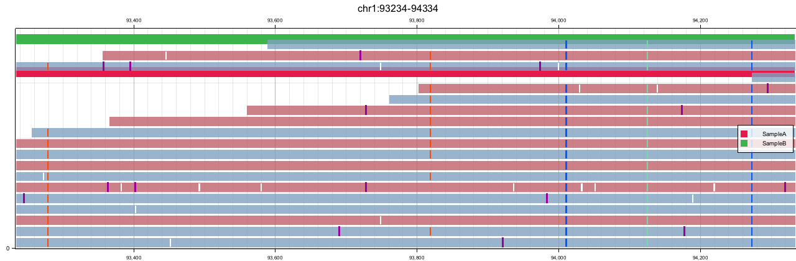

\newpage

### Read alignment visualization with alignment coverage tracks

`cargo run --release -- vis -a test/input1.bam test/input2.bam -o fig/output16.png -r chr1:93234-94334 -P`

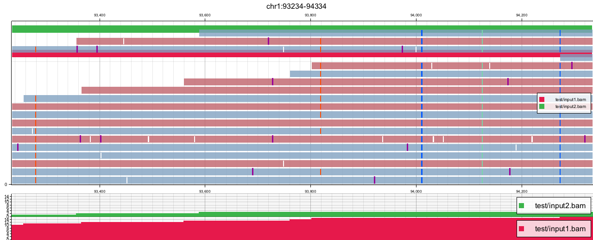

\newpage

### Read alignment visualization colored by name

`cargo run --release -- vis -a test/input1.bam -o fig/output17.png -r chr1:93234-94334 -n`

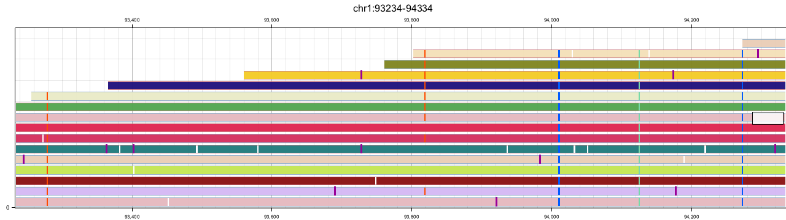

\newpage

### Read alignment visualization without rulers

`cargo run --release -- vis -a test/input1.bam -o fig/output18.png -r chr1:93234-94334 -S`

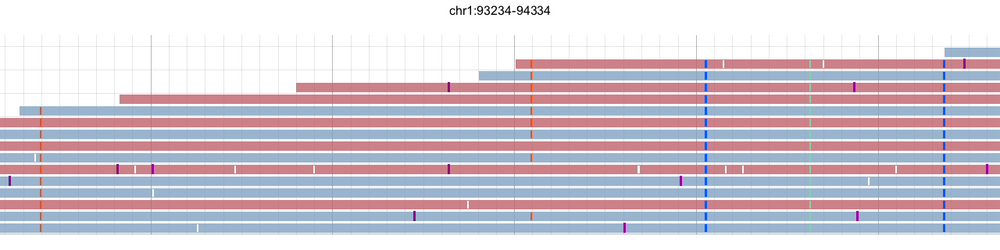

\newpage

### Read alignment visualization with displaying read ids

`cargo run --release -- vis -a test/input1.bam -o fig/output19.png -r chr1:93234-94334 -H`

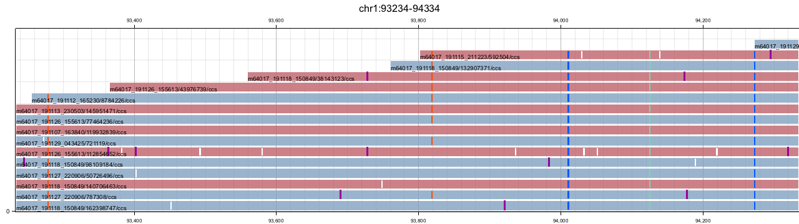

\newpage

### Read alignment visualization with displaying insertion sequences

`cargo run --release -- vis -a test/input1.bam -o fig/output20.png -r chr1:93234-94334 -{`


\newpage
## Supplementary Note

### A parameters on HGB command

```
hgb-vis 
Visualizes genomic data, e.g. read alignments and annotations

USAGE:
    hgb vis [FLAGS] [OPTIONS] --range <range>... [--] [INPUT]

ARGS:
    <INPUT>    (Optional) GHB format to display both alignment and annotation tracks

FLAGS:
    -&, --not-adjust-y                    Do not adjust y parameter on server mode
    -B, --all-bases                       Shows all nucleotides with color
    -n, --colored-by-name                 Sets read colors by read name
    -?, --colored-by-track                Sets read colors by track on hgb
    -%, --write-json                      Dumps JSON of read metadata
    -D, --dynamic-range-partition
            Divides multiple genomic ranges of fields with dynamic width

    -e, --show-split-alignment-callets
            Shows symbols on ends of read alignments if the read contains split-alignment

    -3, --only-full-length-alignments
            Displays only NOT split alignments or mate-paired reads on alignment track

    -4, --full-length-reads
            Displays only full-length match reads against prefetch range

    -h, --help                            Prints help information
    -A, --only-coverage-plot
            Hides read alignments (display only coverage; for chromosome scale view)

    -{, --show-insertion-sequence         Shows insertion sequences along with insertion symbols
    -7, --no-bold-line                    Draws a mesh without bold lines
    -c, --hide-cigar                      Do not show cigar string
    -+, --hide-deletion                   Hides deletion symbols on read alignments
    -f, --disable-read-prefilter
            Disables pre-filtering on loading BAM index (used for debugging)

    -I, --hide-insertion                  Hides insertion symbols on read alignments
    -l, --hide-legend                     Hides legend
    -p, --disable-read-packing            Disables read packing
    -*, --hide-x-scale                    Do not show x-axis ruler
    -S, --hide-y-scale                    Do not show y-axis scale and legends
    -u, --only-split-alignments
            Displays only split alignments or mate-paired reads on alignment track

    -T, --show-translocation-callets
            Shows symbols on ends of read alignments if the read contains translocational split-
            alignment

    -5, --write-split-alignment           Writes a list of translocation split-alignment to stdout
    -P, --coverage-plot                   Shows both pileup and coverage plot
    -$, --serve-as-production
            Serves a web server on production mode (no cross-origin request is allowed)

    -q, --read-quality                    Displays reads colored by quality value
    -1, --read-per-line                   Shows a read per line on split-alignment mode
    -2, --read-per-line-two-ranges
            Shows a read per line across two ranges on split-alignment mode

    ->, --rest-server                     Serves a web server that accepts any parameters
    -H, --show-read-ids                   Writes a read id on the beginning of each read
    -C, --show-split-alignment-line       Displays each split-alignment connection as a colored line
    -N, --sort-by-name
            Sorts alignments by read id (for split-alignment visualization)

    -s, --align-reads-horizontally        Displays split alignments in the same line
    -Q, --square
            Sets width as the same as height to generate s square image (overwritten)

    -U, --udon                            Colors by udon library
        --version                         Prints version information
    -W, --whole-chromosome                Pretends as if the prefetch range is the whole chromosome
    -9, --input-range-is-width
            Sets the genomic interval of the input range as width pixels instead of x parameter


OPTIONS:
    -a, --bam <bam>...
            [Input] Sorted BAM to display read alignment track

    -[, --basic-auth <basic-auth>
            Basic authentication on web server (username:password)

    -L, --bed <bed>...
            [Input] A subset of sorted bed to display as annotation track

    -J, --bed-range <bed-range>
            BED file to specify multiple regions to display

    -^ <border-height>
            The height of border between samples

    -d, --cache-directory <cache-dir>
            Cache directory for web server (generated randomly if not specified)

    -E, --colored-by-motif <colored-by-motif>
            Sequence motif to be colored (for bisulfite sequencing) [default: C:T:CG]

    -0, --colored-by-tag <colored-by-tag>
            Tags on read alignments to be colored [default: ]

    -~, --filtered-by-tag <filtered-by-tag>
            Tag on read alignments as <tag>:<value> to be filtered by (e.g. HP:0)

    -O, --output-format <format>
            Output format (automatically detected; optionally used for server mode)

    -Y, --y-scale <freq-height>
            The height of each coverage track

    -F, --frequency <frequency>...
            [Input] A subset of sorted bed for coverage plot (start and score fields are used)

    -g, --gff3 <gff3>...
            [Input] A subset of sorted gff3 to display as annotation track

    -G, --graph <graph>
            [Input] Graph genome coordinates tsv (tab-separated, generated by vg view -N command)

    -i, --id <id>...
            Indices on GHB data structure to display (used for debugging)

    -}, --labels <labels>...                                        Labels displayed on legend
    -m, --max-coverage <max-coverage>
            Maximum coverage value on coverage track

    -M, --min-read-length <min-read-length>
            Minimum read mapping length on coverage/alignment track

    -K, --bed-neighbor-bases <neighbor>
            Visualizes specified base-pair neighbor of BED region

    -(, --flag-exclude <no-bits>
            Read must have NONE of these flags [default: 1796]

    -o, --output <output>
            [Output] Image file (prefixed as .bmp / .png)

    -R, --prefetch-range <prefetch-range>...
            (Optional) Genomic range to pre-fetch. The same order as range option. Format is
            chr:from-to

    -z, --preset <preset>
            Preset (always overwrites other options) ['auto', 'base', 'gene', 'chrom', 'sv', 'qual']
            [possible values: , auto, base, gene, chrom, sv, qual]

    -#, --preset-color <preset-color>
            Preset color scheme ['igv', 'hgb', 'jbrowse'] (default is hgb [possible values: , hgb,
            igv, jbrowse]

    -r, --range <range>...
            Genomic range to visualize. Format is chr:from-to

    -8, --range-index <range-index>
            Range index to visualize when multiple ranges are specified

    -_, --read-index <read-index>
            Read index to visualize of a single input file

    -), --filtered-by-read-name <read-name>                         Read name to filter by
    -!, --2bit <ref-column>
            [Input] 2 bit file of reference genome to display the base colors of reference genome

    -j, --grouped-by-tag <separated-by-tag>
            Tracks are grouped by specified tags on read alignments [default: ]

    -k, --grouped-by-tag-offset <separated-by-tag-offset>
            The maximal number of tracks by a specified tag on read alignments [default: 3]

    -V, --heterozygous-frequency <snp-frequency>
            The portion of heterozygous allele frequency to display on each coverage track

    -., --static-directory <static-dir>
            Static serve directory for web server [default: ./static]

    -6, --translocation-target-chromosome <translocation-target>
            Target chromosome on writing a list of translocation

    -t, --ghb-type <type>
            The type of GHB data structure to display (used for debugging) [possible values:
            alignment, range, default]

    -], --unix-socket <unix-socket>
            Web server mode running on unix socket

    -w, --web-server <web>
            Web server mode running on TCP socket (host:port)

    -<, --caption <with-caption>
            Caption on the top of chart [default: ]

    -x <x>                                                          The width of image
    -X, --x-scale <x-scale>                                         Size of legends on x-scale
    -y <y>
            The height of each read alignment

    -Z, --zoom-range <zoom-range>
            Maximum zoom level of DZI format on web server mode
```